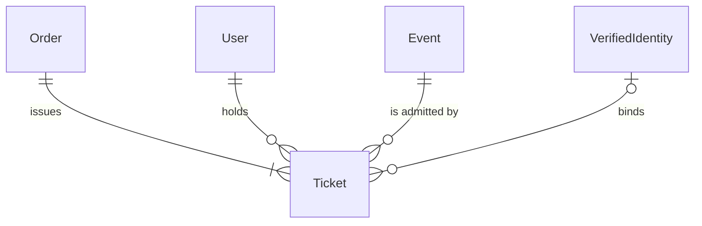
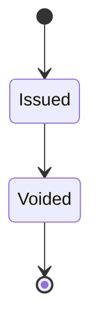

# Ticket

## Purpose

A Ticket is one account-bound admission right to an event, issued from an Order. Every Ticket is a 特定興行入場券 (covered ticket): it names the event and its holder and states that resale without the organizer's consent is prohibited.

| attribute | meaning | constraint |
|-----------|---------|------------|
| id | the ticket's identity | required, assigned on issuance |
| order | the Order that issued it | required |
| holder | the account the ticket is currently bound to | required |
| event | the event it admits to, which gives the date and venue on its face | required |
| holder full name | the holder's name noted on the face (本人確認) | required, 1-200 characters |
| holder phone number | the holder's contact phone noted on the face (本人確認) | required, 1-20 characters |
| verified identity | the verified identity the ticket is bound to | optional; set only when the phase required verification |
| resale without consent prohibited | the face states that resale without the organizer's consent is prohibited | always true |
| status | lifecycle; a Voided ticket is no longer valid for entry | Issued or Voided |
| issued time | when the ticket was issued | required |

## Requirements

### Requirement: Every ticket is a covered ticket

Every Ticket SHALL carry the three conditions of a 特定興行入場券: its face states that resale without the organizer's consent is prohibited; it names the event (date and venue) and the eligible person, who is the holder named by the holder full name, with no seat assigned; and it records the holder's name and contact phone (本人確認).

#### Scenario: Issued ticket face

- **WHEN** a Ticket is issued
- **THEN** it states that resale without consent is prohibited, names its event and its holder, carries the holder's name and phone, and has no seat

#### Scenario: Resale flag cannot be false

- **WHEN** a Ticket states resale without consent is not prohibited
- **THEN** the Ticket is invalid

### Requirement: A new ticket starts Issued

A Ticket SHALL start in status Issued.

#### Scenario: New ticket

- **WHEN** a Ticket is issued
- **THEN** its status is Issued
