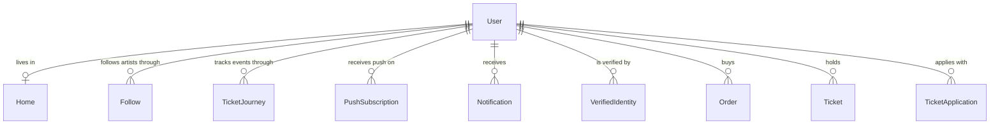

# User

## Purpose

A User is a person registered on Liverty Music, linked to exactly one identity at the identity provider; it carries the contact address, display name, preferred display language and optional home area used to personalize concert notifications and proximity. A Home is a value owned by one User: the geographic area where the user regularly attends live events without considering it a trip (遠征).

User

| attribute | meaning | constraint |
|-----------|---------|------------|
| id | the user's platform identifier | required; assigned when the User is created and never changes |
| external id | the user's identifier at the identity provider | required; non-empty; no two Users share it |
| email | primary contact and account address | required; an email address; no two Users share it |
| name | display name taken from the identity provider | required; may be empty text |
| preferred language | display language for the UI and notifications | optional; when present exactly two lowercase letters (ISO 639-1, e.g. `ja`, `en`); absent means no client has asserted a language yet |
| home | the user's home area | optional; absent until the user selects an area |

Home

| attribute | meaning | constraint |
|-----------|---------|------------|
| id | identifier of the home | required; assigned when the User first gets a home and kept when the home is changed later |
| country code | home country | required; ISO 3166-1 alpha-2, two uppercase letters (e.g. `JP`) |
| level 1 | first-order subdivision: prefecture, state, Land | required; ISO 3166-2: two uppercase letters, a hyphen, then 1 to 3 uppercase letters or digits (e.g. `JP-13`); its first two letters are the country code |
| level 2 | finer area within level 1, in a code system chosen by the country (US: FIPS county code, DE: AGS; JP: not defined, always absent) | optional; 1 to 20 bytes of text when present |
| centroid | approximate geographic centre of the level 1 area, the reference point for Nearby classification | optional; set when the home is stored and level 1 is in the supported catalog (the 47 Japanese prefectures), absent otherwise |

## Requirements

### Requirement: A new User gets a fresh identifier

A new User SHALL receive a fresh id when it is created, distinct from every other User's id, and SHALL keep the external id, email, name and preferred language it was created with.

#### Scenario: New User

- **WHEN** a User is created for external id `abc`, email `fan@example.com` and preferred language `ja`
- **THEN** it has a fresh id, external id `abc`, email `fan@example.com` and preferred language `ja`

### Requirement: Preferred language format

A preferred language value SHALL be valid only when it is exactly two lowercase Latin letters (ISO 639-1).

#### Scenario: Two lowercase letters

- **WHEN** the value is `ja` or `en`
- **THEN** it is a valid preferred language

#### Scenario: Any other shape

- **WHEN** the value is empty, `jpn`, `JA` or `ja-JP`
- **THEN** it is not a valid preferred language

### Requirement: Home validation

A Home SHALL be valid only when its country code is two uppercase letters, its level 1 is two uppercase letters, a hyphen and 1 to 3 uppercase letters or digits, the first two letters of level 1 equal the country code, and level 2, when present, is 1 to 20 bytes of text. Any Home that breaks one of these rules SHALL be invalid.

#### Scenario: Valid home without level 2

- **WHEN** a Home has country code `JP`, level 1 `JP-13` and no level 2
- **THEN** it is valid

#### Scenario: Valid home with level 2

- **WHEN** a Home has country code `US`, level 1 `US-CA` and level 2 `06037`
- **THEN** it is valid

#### Scenario: Malformed country code

- **WHEN** a Home has country code `j` or `jp`
- **THEN** it is invalid

#### Scenario: Malformed level 1

- **WHEN** a Home has level 1 `INVALID`
- **THEN** it is invalid

#### Scenario: Level 1 in another country

- **WHEN** a Home has country code `JP` and level 1 `US-CA`
- **THEN** it is invalid

#### Scenario: Empty level 2

- **WHEN** a Home has level 2 present but empty
- **THEN** it is invalid

#### Scenario: Level 2 too long

- **WHEN** a Home has a level 2 of 21 bytes, such as 21 ASCII characters or 7 kanji
- **THEN** it is invalid
