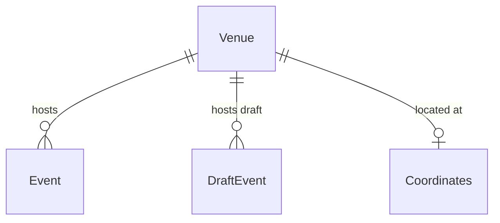

# Venue

## Purpose

A Venue is a physical place where Events are held, known by a canonical name, the administrative area it lies in, its location and, when resolved, its map place identity. The name a source used for it is kept so the same place is recognised again.

| attribute | meaning | constraint |
|-----------|---------|------------|
| id | venue identifier | required |
| name | canonical name; the listed venue name when the place was not resolved | required, non-empty |
| admin area | ISO 3166-2 subdivision the venue lies in | optional, matches `^[A-Z]{2}-[A-Z0-9]{1,3}$`; absent means unknown |
| place id | map place identity | optional; at most one Venue per place id |
| coordinates | location | optional Coordinates |
| listed venue name | the name as first listed by a source or organizer, normalized | optional; with the admin area, identifies the Venue |

## Requirements

### Requirement: Admin area format

A Venue's admin area, when present, SHALL be an ISO 3166-2 subdivision code: two uppercase letters, a hyphen and 1–3 uppercase letters or digits.

#### Scenario: Valid admin area
- **WHEN** the admin area is JP-13
- **THEN** it is valid

#### Scenario: Free-text admin area is invalid
- **WHEN** the admin area is "東京都"
- **THEN** it is invalid

### Requirement: Listed venue name normalization

A listed venue name SHALL be normalized by folding full-width and half-width forms to one form, collapsing runs of whitespace to a single space and trimming the ends, removing a leading "〈city〉公演 ＠" prefix, and then removing a leading "〈prefecture〉・" prefix where the prefecture is one of Japan's 47 prefectures, with or without its 都/道/府/県 suffix. A name that is blank after normalization SHALL be treated as missing. Normalizing an already-normalized name SHALL leave it unchanged.

#### Scenario: Prefecture prefix removed
- **WHEN** the listed venue name is "大阪・フェスティバルホール"
- **THEN** the normalized name is "フェスティバルホール"

#### Scenario: Performance-city prefix removed
- **WHEN** the listed venue name is "大阪公演 ＠フェスティバルホール"
- **THEN** the normalized name is "フェスティバルホール"

#### Scenario: Middle dot after a non-prefecture word is kept
- **WHEN** the listed venue name is "東京文化会館・大ホール"
- **THEN** the normalized name is "東京文化会館・大ホール"

#### Scenario: Whitespace-only name is missing
- **WHEN** the listed venue name is "　 "
- **THEN** the normalized name is empty and the name is treated as missing

#### Scenario: Already normalized name is unchanged
- **WHEN** the listed venue name is "日本武道館"
- **THEN** the normalized name is "日本武道館"

### Requirement: Canonical name falls back to the listed name

When a Venue is made without a resolved place, its name SHALL be its listed venue name and it SHALL have no place id and no coordinates.

#### Scenario: Unresolved venue
- **WHEN** a Venue is made for listed name "ライブハウスX" with no resolved place
- **THEN** its name is "ライブハウスX" and it has no place id and no coordinates
