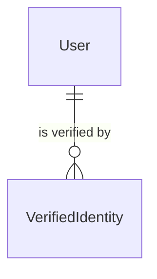
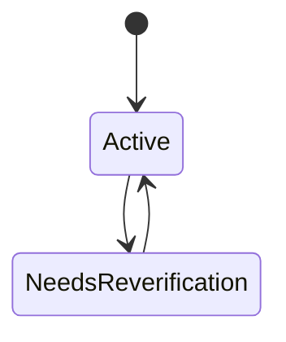

# VerifiedIdentity

## Purpose

A VerifiedIdentity binds one User's account to a real person who passed a 本人確認 (identity check); it keeps only the result of the check, never the card data. A person may back at most one account with an Active VerifiedIdentity.

| attribute | meaning | constraint |
|-----------|---------|------------|
| id | identifier of the verification | required; assigned on creation |
| user | the account it verifies | required |
| method | how the person proved their identity | required; マイナンバーカード (My Number Card) or 運転免許証 (driver's licence) |
| person key | the identity-check service's stable key for the person | required; the only person-identifying value kept |
| verified time | when the check succeeded | required |
| status | whether the verification still holds | required; Active or NeedsReverification |

## Requirements

### Requirement: A new verification starts Active

A new VerifiedIdentity SHALL start Active, with its verified time set to the time it is created.

#### Scenario: Fan passes the identity check

- **WHEN** a VerifiedIdentity is created for a fan who verified with My Number Card
- **THEN** its status is Active

### Requirement: Strength of the one-person guarantee follows the method

A VerifiedIdentity's one-person guarantee SHALL be strong when the method is My Number Card, because its person key survives card renewal, and weak when the method is driver's licence, because its key can change.

#### Scenario: My Number Card

- **WHEN** the method is My Number Card
- **THEN** the guarantee is strong

#### Scenario: Driver's licence

- **WHEN** the method is driver's licence
- **THEN** the guarantee is weak
