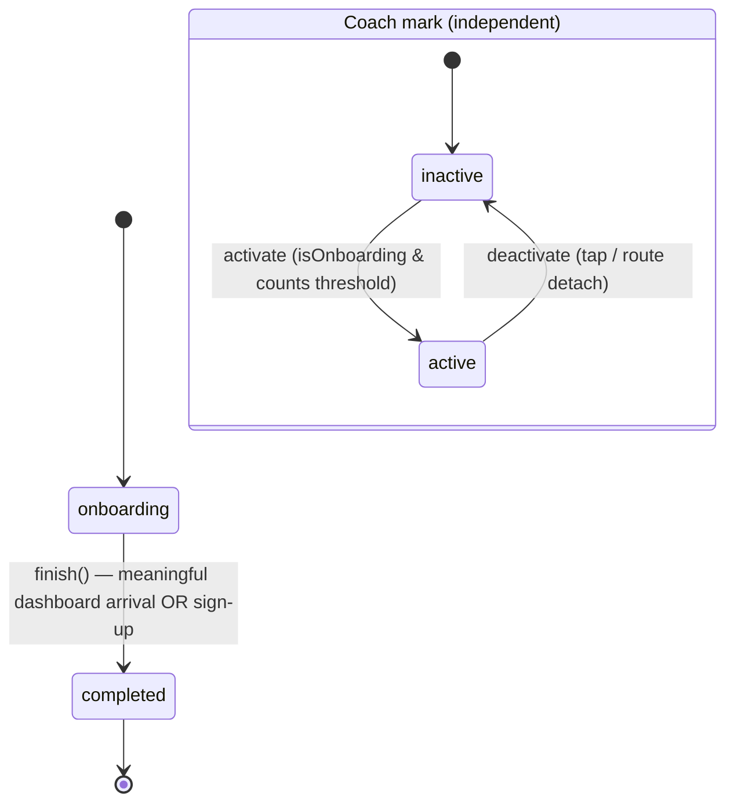

# State Transition Diagram Specification

## 1. Onboarding State

### 1.1 Overview

Onboarding is a single latched boolean, not an ordered step machine. A brand-new user
starts in the `onboarding` state and transitions once, irreversibly, to `completed`. There
is no forced navigation ordering: the dashboard and every route are reachable at any time
(soft gate), and a guest with no follows is guided by an in-page empty-state CTA rather than
a guard redirect. The flag is exposed as `OnboardingService.isOnboarding`
(`isCompleted === !isOnboarding`) and persisted as `onboardingComplete` (absent key =
still onboarding).

### 1.2 States

| State        | Description                                                |
|--------------|------------------------------------------------------------|
| `onboarding` | First-run experience (default for a new user)              |
| `completed`  | Onboarding finished (terminal; one-way)                    |

### 1.3 Transitions

| Trigger                              | From         | To          | Where                          |
|--------------------------------------|--------------|-------------|--------------------------------|
| Meaningful first dashboard arrival ¹ | `onboarding` | `completed` | dashboard-route (`finish()`)   |
| Sign-up (idempotent backstop)        | `onboarding` | `completed` | auth-callback-route (`finish()`)|

¹ "Meaningful" = the timetable is real (region set + concert data loaded) **and** the guest
has at least one followed artist (`followedCount >= 1`). The latch is evaluated after the
light-celebration decision but is driven by the data-ready + engaged condition, not by whether
the celebration overlay rendered. A zero-follow dashboard arrival does NOT latch. Completion is
one-way; it never returns to `onboarding` except via an explicit fresh-onboarding reset. The
legacy `onboardingStep` value is migrated once on load (`'completed'`/`'7'` → completed).

### 1.4 Coach Mark (independent)

The coach mark is a single, transient, non-blocking hint owned by `CoachMarkService` — not part
of the onboarding state. It is activated from `DiscoveryRoute` when `isOnboarding` and the live
follow/concert counts cross the threshold (`followedCount >= 5` OR `artistsWithConcertsCount >= 3`),
and dismissed on target tap or route detach. It does not lock scroll or block off-target
interaction, and tapping it navigates only (no state mutation).

| Action                       | From       | To         |
|------------------------------|------------|------------|
| `CoachMarkService.activate`  | `inactive` | `active`   |
| `CoachMarkService.deactivate`| `active`   | `inactive` |

### 1.5 State Diagram

---

## 2. Guest Data

### 2.1 Overview

The guest state machine tracks ephemeral data accumulated before the user creates an account:
followed artists and home location. This data is merged into the backend on signup,
then cleared.

### 2.2 Transitions

Guest state is a simple data bag — there are no discrete named states, only data mutations.
The key invariant is: `guest/follow` is idempotent (duplicate artistId is a no-op).

| Action              | Effect                                                  | Where                  |
|---------------------|---------------------------------------------------------|------------------------|
| `guest/follow`      | Append `{ artistId, name }` to follows (skip if exists) | discovery-route        |
| `guest/unfollow`    | Remove entry by artistId                                | my-artists-route       |
| `guest/setUserHome` | Set home ISO-3166-2 code                                | area-selector (modal)  |
| `guest/clearAll`    | Reset follows to `[]` and home to `null`                | welcome-route, merge   |
