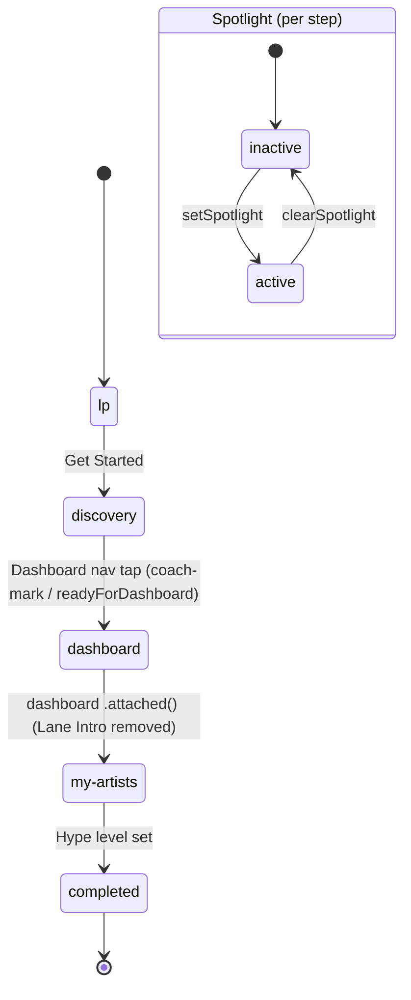

# State Transition Diagram Specification

## 1. Onboarding State Machine

### 1.1 Overview

The onboarding state machine guides new users through a linear multi-step introduction flow.
Each step advances strictly forward. The flow completes when the user sets a hype level on the
My Artists screen.

### 1.2 States

| State       | Description                              |
|-------------|------------------------------------------|
| `lp`        | Landing page (initial state)             |
| `discovery` | Artist discovery screen                  |
| `dashboard` | Personal timetable dashboard             |
| `my-artists`| User's followed-artists list             |
| `completed` | Onboarding finished (terminal state)     |

### 1.3 Transitions

| Trigger                  | From          | To            | Where                          |
|--------------------------|---------------|---------------|--------------------------------|
| Get Started button       | `lp`          | `discovery`   | welcome-route                  |
| Dashboard nav tap ¹      | `discovery`   | `dashboard`   | auth-hook (coach-mark / readyForDashboard) |
| Dashboard arrival        | `dashboard`   | `my-artists`  | dashboard-route (`attached`)   |
| Hype level set           | `my-artists`  | `completed`   | my-artists-route               |

¹ User taps the Dashboard nav tab once the progression condition is met (coach-mark spotlight or `readyForDashboard`). There is no longer a separate "Generate Dashboard" CTA, and no `detail` step.

### 1.4 Spotlight Sub-States

Within each onboarding step, a spotlight overlay can be activated to highlight a UI target.
The spotlight is set and cleared independently of step transitions.

| Action                    | From       | To         |
|---------------------------|------------|------------|
| `onboarding/setSpotlight` | `inactive` | `active`   |
| `onboarding/clearSpotlight`| `active`  | `inactive` |

### 1.5 State Diagram

---

## 2. Guest Data

### 2.1 Overview

The guest state machine tracks ephemeral data accumulated before the user creates an account:
followed artists and home location. This data is merged into the backend on signup,
then cleared.

### 2.2 Transitions

Guest state is a simple data bag — there are no discrete named states, only data mutations.
The key invariant is: `guest/follow` is idempotent (duplicate artistId is a no-op).

| Action              | Effect                                                  | Where                  |
|---------------------|---------------------------------------------------------|------------------------|
| `guest/follow`      | Append `{ artistId, name }` to follows (skip if exists) | discovery-route        |
| `guest/unfollow`    | Remove entry by artistId                                | my-artists-route       |
| `guest/setUserHome` | Set home ISO-3166-2 code                                | area-selector (modal)  |
| `guest/clearAll`    | Reset follows to `[]` and home to `null`                | welcome-route, merge   |
