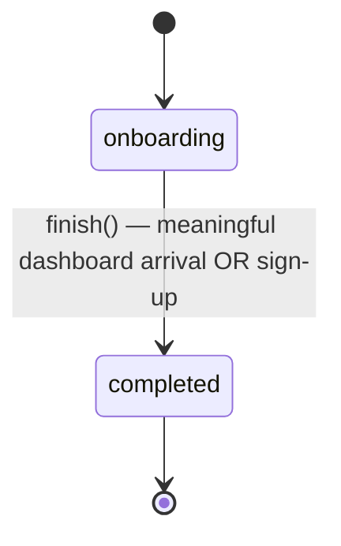

# State Transition Diagram Specification

## Purpose

Defines the client-side state machines that govern the first-run experience: the one-way onboarding latch, the independent coach-mark hint, and the ephemeral guest-data state accumulated before account creation. It captures each machine's states, transitions, triggers, persistence, and invariants so the frontend behaves consistently across routes.

## Requirements

### Requirement: Onboarding is a one-way latched boolean

Onboarding SHALL be modeled as a single latched boolean, not an ordered step machine. A brand-new user starts in the `onboarding` state and transitions exactly once, irreversibly, to `completed`. There SHALL be no forced navigation ordering — every route is reachable at any time (soft gate); a guest with no follows is guided by an in-page empty-state CTA, not a guard redirect. The flag is exposed as `OnboardingService.isOnboarding` (`isCompleted === !isOnboarding`) and persisted as `onboardingComplete` (absent key = still onboarding).

| State        | Description                                   |
|--------------|-----------------------------------------------|
| `onboarding` | First-run experience (default for a new user) |
| `completed`  | Onboarding finished (terminal; one-way)       |

```mermaid
stateDiagram-v2
    [*] --> onboarding
    onboarding --> completed : finish() — meaningful dashboard arrival OR sign-up
    completed --> [*]
```

#### Scenario: New user defaults to onboarding

- **WHEN** a brand-new user with no persisted `onboardingComplete` key loads the app
- **THEN** `OnboardingService.isOnboarding` SHALL be `true`

#### Scenario: Meaningful dashboard arrival latches completion

- **WHEN** the user arrives at the dashboard AND the timetable is real (region set and concert data loaded) AND `followedCount >= 1`
- **THEN** `dashboard-route` `finish()` SHALL latch the state to `completed`
- **AND** the latch SHALL be driven by the data-ready + engaged condition, not by whether the celebration overlay rendered

#### Scenario: Zero-follow dashboard arrival does not latch

- **WHEN** the user arrives at the dashboard with `followedCount === 0`
- **THEN** the state SHALL remain `onboarding`

#### Scenario: Sign-up is an idempotent completion backstop

- **WHEN** the user completes sign-up via `auth-callback-route`
- **THEN** `finish()` SHALL latch the state to `completed`
- **AND** invoking it when the state is already `completed` SHALL be a no-op

#### Scenario: Completion is one-way

- **WHEN** the state is `completed`
- **THEN** it SHALL NOT return to `onboarding` except via an explicit fresh-onboarding reset

#### Scenario: Legacy onboardingStep is migrated on load

- **WHEN** the app loads with a legacy `onboardingStep` value of `'completed'` or `'7'`
- **THEN** the state SHALL be migrated once to `completed`

### Requirement: Coach mark is an independent, non-blocking hint

The coach mark SHALL be a single, transient, non-blocking hint owned by `CoachMarkService`, separate from onboarding state. It is activated from `DiscoveryRoute` when `isOnboarding` is true and the live counts cross the threshold (`followedCount >= 5` OR `artistsWithConcertsCount >= 3`), and dismissed on target tap or route detach. It SHALL NOT lock scroll or block off-target interaction, and tapping it SHALL navigate only (no state mutation).

| Action                        | From       | To         |
|-------------------------------|------------|------------|
| `CoachMarkService.activate`   | `inactive` | `active`   |
| `CoachMarkService.deactivate` | `active`   | `inactive` |

#### Scenario: Coach mark activates when thresholds cross

- **WHEN** `isOnboarding` is true AND (`followedCount >= 5` OR `artistsWithConcertsCount >= 3`)
- **THEN** `CoachMarkService.activate` SHALL move the coach mark from `inactive` to `active`

#### Scenario: Coach mark deactivates on tap or route detach

- **WHEN** the coach-mark target is tapped OR the route detaches
- **THEN** `CoachMarkService.deactivate` SHALL move it from `active` to `inactive`

#### Scenario: Coach mark does not block interaction

- **WHEN** the coach mark is `active`
- **THEN** it SHALL NOT lock scroll or block off-target interaction
- **AND** tapping it SHALL navigate only, with no onboarding-state mutation

### Requirement: Guest data accumulates before signup and clears after merge

Guest state SHALL be a simple data bag tracking ephemeral data accumulated before the user creates an account (followed artists and home location). On signup the data is merged into the backend, then cleared. There are no discrete named states, only data mutations. The key invariant is that `guest/follow` is idempotent — a duplicate `artistId` is a no-op.

| Action              | Effect                                                  | Where                 |
|---------------------|---------------------------------------------------------|-----------------------|
| `guest/follow`      | Append `{ artistId, name }` to follows (skip if exists) | discovery-route       |
| `guest/unfollow`    | Remove entry by artistId                                | my-artists-route      |
| `guest/setUserHome` | Set home ISO-3166-2 code                                | area-selector (modal) |
| `guest/clearAll`    | Reset follows to `[]` and home to `null`                | welcome-route, merge  |

#### Scenario: guest/follow is idempotent

- **WHEN** `guest/follow` is dispatched with an `artistId` already present in the follows list
- **THEN** the list SHALL be unchanged (no duplicate entry)

#### Scenario: guest/follow appends a new artist

- **WHEN** `guest/follow` is dispatched from `discovery-route` with a new `artistId`
- **THEN** `{ artistId, name }` SHALL be appended to the follows list

#### Scenario: guest/unfollow removes an entry

- **WHEN** `guest/unfollow` is dispatched with an `artistId` present in the list
- **THEN** the matching entry SHALL be removed by `artistId`

#### Scenario: guest/setUserHome sets the home code

- **WHEN** `guest/setUserHome` is dispatched from the area selector
- **THEN** the guest home SHALL be set to the given ISO-3166-2 code

#### Scenario: guest/clearAll resets on merge or welcome

- **WHEN** `guest/clearAll` is dispatched (from `welcome-route` or after a signup merge)
- **THEN** follows SHALL be reset to `[]` and home to `null`
